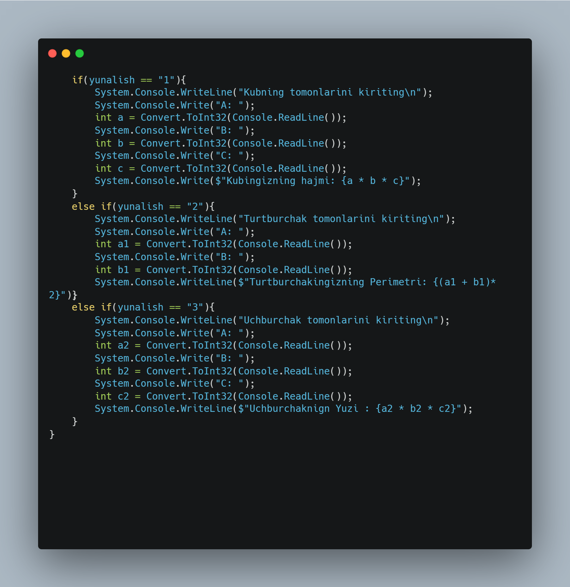
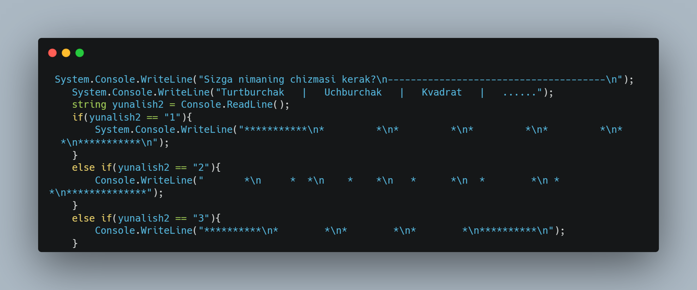

    // ---------------------------------------------------------------
    // Copyright (c) Coalition of the Good-Hearted Engineers
    // FREE TO USE TO CONNECT THE WORLD
    // ---------------------------------------------------------------

# Bu dastur nimalar qila oldi?

+ Siz bunda xar xil amallarni bajara olasiz 
Maslan: Perimetrni hisoblash, yuzani topish va hokozo 

---
- Shakillarning chizmasini topa olasiz 
Misol uchun: Uchburchak, turtburchak .  .  . 

---
+ Calculatordan foydalanishingiz mumkin 

---

